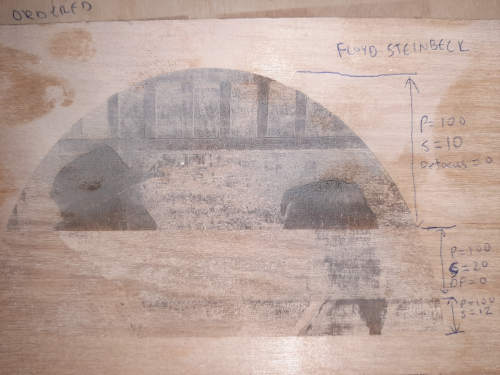
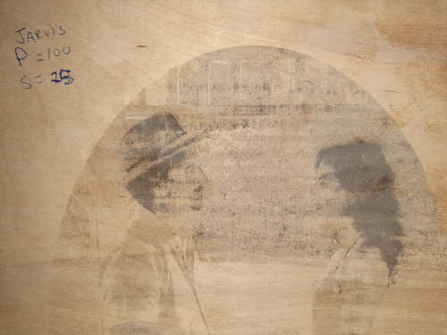

+++
title = "Laser Cutting"
image = "PressFitFinal.jpg"
weight = 30

[typeScript] 
typeScript1 = "Laser Cutting: showcasing my laser cutting skills" 
typeScript2 = "See the work I did for the laser cutting weeks' assignment of Fab Academy"

[headline]
headline = "Objective: to design, lasercut, and document a parametric press-fit construction kit, which can be assembled in multiple ways."
+++

The assignment for this week was to learn the basics of computer controlled cutting using a vinyl cutter and a laser cutter. The assignments for this week were:

- Group assignment
   - characterize your lasercutter's focus, power, speed, rate, kerf, and joint clearance
   - document your work (individually or in group)

- Individual assignments
  - Design, lasercut, and document a parametric press-fit construction kit, which can be assembled in multiple ways. Account for the lasercutter kerf.
  - cut something on the vinylcutter

The desired learning outcomes for the week were to:

- Demonstrate and describe parametric 2D modelling processes
- Identify and explain processes involved in using the laser cutter.
- Develop, evaluate and construct the parametric construction kit
- Identify and explain processes involved in using the vinyl cutter.
Have you

To discuss the work completed this week I will share first the group assignment, and then the individual assignment.

## Group Assignment

The objective of the group assignment was to characterize our lasercutter's focus, power, speed, rate, kerf, and joint clearance and document our work.

Before beginning with the exercise. Our Fab Node Instructor Jason went through a detailed overview of how to use the laser cutter. His instructions are included in the video below (warning, its long):



After learning how to operate the laser cutter and cutting an hp logo out of cardboard, we then moved on to characterising the focus, power and speed. To accomplish this, I selected a project in which I was to rastor an photo of my wife and I onto a piece of wood. We first started with comparing the type of rastor, between jarvis and ordered using a test piece of plywood. The result is illustrated below:



Next we looked at the effect of speed, focus, and power. These are illustrated in the photos below in which: 

P = Power
S = Speed
DF = Defocus height (approx)

![Defocus] (defocus.jpg)

After having investigating the various settings and characterising the correct settings for this piece, the final values were determined as the right values for the project. The values are given below:

P = 100 %
S = 12 %
DF = 0 mm
Style = jarvis

The final result of the characterisation is illustrated in the photo below:



below is a video describing the 2D modeling methods that were used:



## Individual Assignments

This week there were two individual assignments, the first was to cut something using the vinyl cutter. For this assignment I elected to cut some stickers for my laptop. The second assignment was to Design, lasercut, and document a construction kit which can be assembled in multiple ways. The kerf of our laser is about 1 mm.

I will present this section as using the vinyl cutter first, and the laser cutter with parametric design second.

### Vinyl cutter

For this assignment, I elected to do a simple project that could also add some flare to my boring old laptop. To do this assignment I first had to learn how to use the vinyl cutter with Jason, and then I designed and cut the Energy Generation logo (organisation that I work for) and an hp logo. 

**Energy Generation Logo for laptop**



**HP logo for laptop**



The cutting was performed using a Roland Vinyl GS-24 cutter as pictured below:



After cutting I used the transfer tape to transfer the logos onto my laptop yielding the final result below.

**Final vinyl-cut stickers on laptop**



The vinyl cutting process is documented in its entirety in the video below:



### Laser cutter

For this assignment I elected to practice laser cutting a piece for my final project that I will eventually want to mill with a CNC out of sheet metal. I wanted to practice taking a circular object, and flattening it out so that you can cut holes in it before bending and riveting it together. To test this out, I made a parametric design of the combustion chamber internal tube shown in the image below.



To make the model parameterized I had to perfom several calculations using the FreeCad Spreadsheets workbench combined with defining/constraining certain variables using equations. I did an in depth look at how to create a parameterized CAD file in Assignment 3 - Computer Aided Design. 

**Parameterised design**

For this week, I chose to focus my time on demonstrating how to take a parameterised sketch made in FreeCad, and prepare it for cutting with the laser. 

To create a parameterised design, you can use FreeCAD to create a sketch that can be exported as SVG and use the Spreadsheet function in FreeCAD to create equations that describe the dimensions and relations that define the drawing. The screenshot below illustrates the spreadsheet.



The dimensions in the spreadsheet controlled the dimensions of the spacing of holes and other considerations and demonstrated in the image below:



Once the document is parameterized to your liking you can now export it as an SVG that can be modified in InkScape to create a file that can be used on the laser cutter.



Lastly, open the SVG in inkscape, join all the vectors, and Save as a .eps file so that it can be loaded onto the laser cutter.



The video below demonstrates how to do this in further detail:



Once the .eps file had been created and imported into the computer that controls the laser cutter, it was simply a matter of cutting it and doing the final preparation as shown below.



And final rolling of the piece as a test of the inner chamber of my final project.



The video below documents the entire parameterisation and laser cutting process in detail.



### Press fit components

Following the completion of the rastoring and cutting exercise for my project. I also completed the laser cutting of components that could be cut and assembled using press fits. I chose to make a christmas ornament in the shape of a snowflake. I started by drawing the image using InkScape to produce the following result.



**Parameterization package**

The snowflakes that were cut were parameterized by simply using InkScape and scaling the entire piece as a function of the ***slit width***. By changing the dimensions of the fit it would scale the entire piece in relation. It would also be possible to do this in FreeCAD using the methodology described in the section above.



It was using this scaling method that I was able to create the various sizes of the snowflakes as shown in the photo below.



**Accounting for Kerf**

after laser cutting, I noticed that the size did not fit well, as the width of slit did not match up with the width of the cardboard. I therefore decided to create a test fit piece and rescale the snowflake to ensure a better press fit. The test fit pieces were simple rectangles with different widths cut out of them. The results of these two pieces were as follows:



To determine the kerf, I created a testfit piece with various widths in it and cut it twice.



I then measured the actual slot widths with a vernier caliper vs. the size that was put into the .eps file to determine the kerf. Our laser's kerf for the cardboard 3.4 mm thick was about 0.05 mm



Based on the press fit test pieces, it was determined that a width of 3.5 mm was ideal to account for the laser's kerf. I therefore used this to rescale the parameterized snowflake design, using the ***slit width*** as the driving variable. The results of the new design are shown below:



The result was MUCH BETTER! and I learned how to adequately test and size my press fits for future projects. Lastly, I took a photo of all of the pieces I cut to show the difference and the progress.



# Files

1. [EGLogo.svg](EGLogo_Conbined.svg)
2. [HPlogo.svg](HP-Logo.svg)
3. [PaulAndNadia.svg](PaulandNadia.svg)
4. [Snowflake.svg](snowflake.svg)
5. [Testfit.eps](TestFit.eps)

